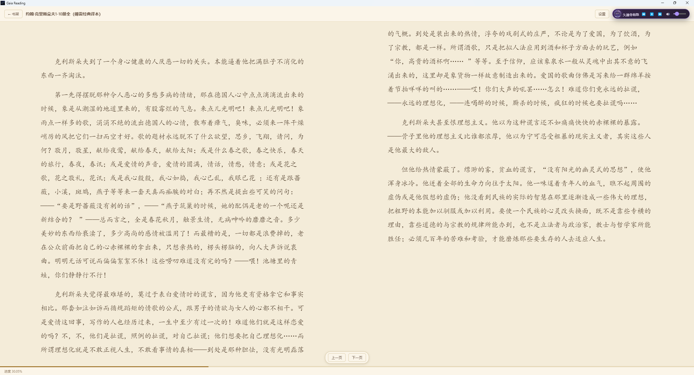

# Gaia Reading

电子书阅读器，基于 Electron，支持 **EPUB / PDF / TXT / MOBI / AZW3** 五种格式，绿色免安装。
当前版本：**0.4.0**

## 功能亮点

### 阅读体验

- 统一阅读引擎：EPUB（epub.js）、PDF（逐页渲染）、MOBI / AZW3 / TXT（自研分页引擎），交互一致
- 单页 / 双页两种阅读模式，双页带书缝线，翻页带滑动渐变动效
- 排版调节：字体（默认/宋体/楷体/黑体/圆体）、字号（A− / A+）、行距、**页边距**（4% / 8% / 12% / 16%，默认 8%）
- 主题：日间 / 护眼 / 夜间三档，全局记忆，重启继续沿用
- 键盘快捷键：← 上一页、→ 下一页、Esc 关闭阅读界面返回书架
- 进度条精确到书内位置（EPUB 用位置索引），断点续读，重新打开回到上次位置

### 书签

- 书签信息卡：可编辑名字 + 所在章节 + 全书进度百分比，五种格式全部支持
- 内容锚点定位：MOBI / AZW3 / TXT 记录「章节 + 正文文字偏移」，改字体/行距重新分页后仍回到同一段；EPUB 用 CFI，PDF 用页码
- TXT 自动识别章节标题（第一章 / 第 X 回 / Chapter X / 序章 / 楔子等），识别不到时显示书签处原文片段
- 旧书签自动兼容

### 背景音乐（BGM）

- 内置 4 首魔法使之夜 OST（320kbps MP3，约 48MB）
- 自动循环久遠寺有珠 / 静希草十郎两首，手动切换可遍历全部 4 首
- 悬浮胶囊：专辑封面、黑紫色配色、波浪形歌名，支持播放/暂停、上一首/下一首、音量、静音
- 位置：首页顶部、书架左下角、阅读界面顶栏右上（与书名同行）
- 音量 / 静音 / 曲目 / 开关自动记忆

### 书架

- 导入单个文件或整个文件夹，自动识别格式，EPUB 显示封面与作者
- 批量管理：多选移除书籍（保留原文件，同步清理进度与书签）
- 右键菜单：打开或从书架移除
- 目录导航：EPUB / MOBI / AZW3，再次点击可关闭

## 界面展示

（按拍摄时间从早到晚）




## 在其他 Windows 电脑上运行

### 方式一：绿色版 exe（推荐，无需安装环境）

在 GitHub Releases 下载最新版 `Gaia Reading 0.4.0.exe`，双击即可运行，无需安装 Node.js。

### 方式二：源码运行

需要先安装 [Node.js LTS](https://nodejs.org/zh-cn)。

```bash
git clone <你的仓库地址>
cd Gaia_Reading
npm install
npm start
```

也可以直接双击仓库根目录的 `start.bat`：自动检查 Node.js、安装依赖并启动应用。

## 测试

```bash
npm test            # 单元测试
npm run smoke       # 冒烟启动测试（应用自动退出）
npm run smoke:open  # 自动化场景：真实打开一本书，验证翻页/双页/进度/书签/BGM/面板
```

## 隐私说明

- 仓库不包含个人书籍、阅读进度、书签或本机路径信息。
- 书籍文件、阅读进度、书签只保存在运行电脑本地（应用数据目录），不会进入仓库。
- 提交历史使用中性身份（gaia-reading），不包含个人信息。
- `tests/fixtures/sample.epub` 是自动化测试示例书，非用户数据。

## 项目结构

```
src/
├── main.js            # Electron 主进程（文件读取、元数据、状态存储、bgm:// 媒体协议）
├── preload.js         # 安全桥接（contextBridge）
├── shared/            # 可单测的共享逻辑（EPUB 元数据、TXT 编码/章节、书签、书架、BGM 播放规则、JSON 存储）
└── renderer/          # 界面（闪屏、首页、书架、阅读器、设置抽屉、BGM 胶囊），vendor 为安装时复制的库
tests/                 # node:test 单元测试 + 自动化冒烟场景
assets/bgm/            # 内置 BGM 音频与专辑封面
```

## 版本记录

详见 [CHANGELOG.md](CHANGELOG.md)。