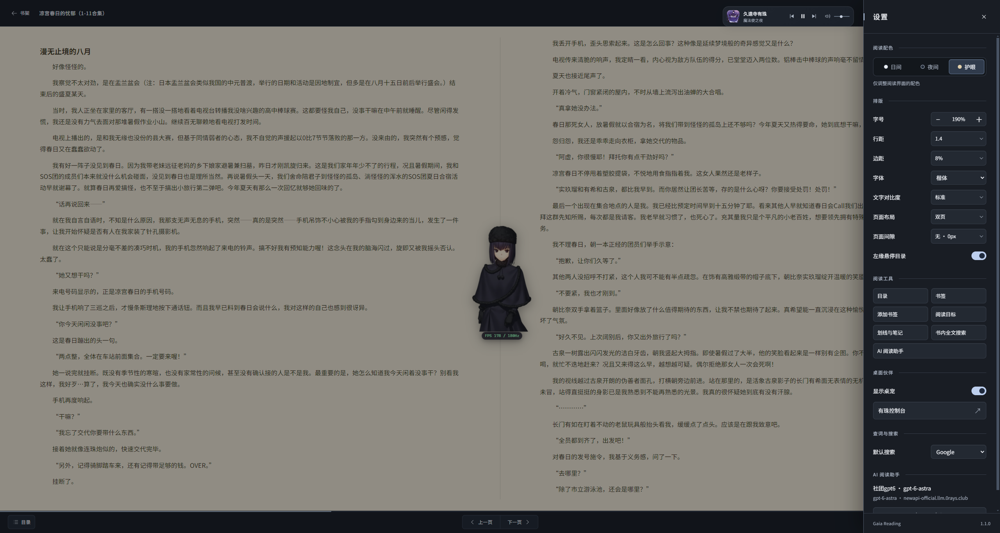

# Gaia Reading

Gaia Reading 是一款面向 Windows 的绿色电子书阅读器，支持 EPUB、PDF、TXT、MOBI 和 AZW3。它把多格式阅读、章节级 AI 对话、划线笔记、阅读统计和桌面角色「久远寺有珠」放在同一个应用中。

当前稳定版本：**1.1.5**

[下载 1.1.5](https://github.com/YangGaia/GaiaReading/releases/tag/v1.1.5) · [查看本版说明](RELEASE_NOTES_1.1.5.md) · [版本记录](CHANGELOG.md)

## 1.1.5 更新亮点

本版修复左右方向键普通点按容易误触长按、一次翻两页或更多页的问题，已通过用户验收。

- 首次按下立即翻一页；连续翻页必须持续按住至少 500ms，并收到同一按键的系统重复事件确认，不再仅按 200ms 计时自动启动。
- 快速独立按键逐次响应，不使用会吞掉点按的翻页冷却；系统重复事件不额外叠加翻页。
- 松手、失焦、换书或打开设置时停止连翻，反向按下重新等待长按确认；双页模式仍一次翻一组。
- 补充短按边界、多种刷新率、迟到重复事件、主界面与正文 iframe 焦点、跨章加载取消的回归测试。

### 延续 1.1.4 的阅读功能

- MOBI／AZW3 按实际内容识别，混合 MOBI 不需改扩展名；正文固定字号也可缩放，并保留标题、脚注层级与阅读位置。
- 大型 KF8 合集按需解析目录、分记录缓存解压，阅读解析在独立进程执行；超过 30 秒会终止并提示，返回书架或换书会取消旧请求，不再拖住整个应用。
- `npm run smoke:mobi-reading -- --book "书籍路径"` 用隔离数据验证格式、字号、目录定位和主进程响应，可重复传入 `--book`；只读原书，报告和预览输出至 `dist/previews/mobi-reading/`。
- 阅读设置新增“文字转换”两态按钮：首次按正文识别简体或繁体；点击即切换，手动选择作为全局习惯保存，后续优先于原文识别。支持 EPUB、TXT、MOBI、AZW3；PDF 固定版式暂不支持，按钮会置灰说明。
- 简繁转换离线进行，保留原始书籍、阅读位置、书签和划线坐标；正文及目录标题跟随显示模式，搜索兼容简繁输入，AI 仍使用原始章节正文。
- AI 中心支持按当前地址和 Key 刷新上游模型，首次无需预填模型 ID，也不会因读取而启用其他档案。模型按系列分组，可搜索、筛选、查看上游提供的用途标签及新增模型。
- 模型列表支持分页和超过 200 个模型；缓存按档案、接口与 Key 隔离，记录刷新时间及增删变化。失败保留上次有效结果，已选模型下架时提示并保留选择，选定后保存即可用于问答。
- `npm run smoke:chinese-models` 使用隔离数据和本地模拟接口验证转换、定位、模型刷新及调用，并输出预览到 `dist/previews/chinese-models/`。

## 界面截图

以下展示启动、书架、阅读、设置与阅读统计等主要界面。

### 启动画面


### 首页


### 书架


### 阅读界面


### 阅读设置界面



### 阅读目标与累计计时器


### AI 阅读中心


## 主要功能

### 阅读

- 支持 EPUB、PDF、TXT、MOBI、AZW3，保留书架、目录、进度和断点续读。
- 首页与书架均可通过“添加图书”选择文件夹、单个文件或一次多选文件；重复图书会自动跳过。
- 批量导入显示当前书籍与已保存数量，支持取消；解析在独立进程中逐本执行，单本超时或异常会跳过，每本成功后保存书架。
- EPUB、MOBI、AZW3 支持目录跳转；MOBI/AZW3 尾注可在应用内往返定位，TXT 可识别常见中英文章节标题。
- 阅读页左下角可随时打开目录；鼠标触碰阅读区最左侧时，目录会自动滑出并在离开后收回，也可在设置中单独关闭触边展开。
- 支持单页、双页、日间、护眼和夜间模式，并可调整字体、字号、行距与页边距。
- 日间、夜间和护眼配色仅作用于阅读界面；首页、书架、阅读目标和 AI 中心保持固定风格。设置侧栏使用独立的石墨灰配色，阅读配色选项只在阅读时显示。
- 日间、护眼和夜间主题均可切换高对比文字，分别使用纯黑、深棕黑和纯白增强可读性。
- EPUB、PDF、TXT、MOBI、AZW3 的双页间隙可在阅读设置中按 0、24、56、96px 四档即时调节。
- PDF 支持单页和双页阅读；双页可切换 `1–2` 或 `2–3` 配对，以适配封面、扉页和扫描页码差异。
- PDF 提供“适合页面”“适合宽度”和 10%～400% 手动缩放，可使用顶栏按钮或 `Ctrl + 鼠标滚轮`；普通滚轮先滚动当前跨页，到边缘后再翻页。
- EPUB、PDF、TXT、MOBI、AZW3 均支持书内全文搜索、结果列表、上下结果切换和正文定位高亮；扫描版 PDF 需先经过 OCR 生成文字层。
- 五种格式均可添加书签、三色划线和笔记。

### AI 阅读助手

- 用户自行配置接口，支持 OpenAI、DeepSeek、兼容 OpenAI 格式的第三方服务和本地 Ollama。
- 可保存多套接口档案，分别管理 Base URL、API Key 和模型，并在阅读时随时切换。
- OpenAI 和自定义接口内置 `gpt-6-astra` 候选，模型 ID 原样保存和发送；实际可用模型由账号权限或接口服务商决定，原有档案不会被自动替换。
- AI 只接收当前逻辑章节作为上下文；正文没有提供的信息会明确说明，不主动补写剧情或剧透后文。
- 提供“总结本章”“人物关系”“伏笔”三个输入快捷键，点击后仅填入问题，由用户确认发送。
- 生成期间可以停止；输入新问题后可以中止旧请求并立即发送。
- “有珠概括”和“有珠吐槽”模仿《魔法使之夜》中久远寺有珠冷静、简短而略带讽刺的说话风格，通过桌宠气泡显示，不进入普通对话记录。

### 划词工具

- 选中文字后可直接划线、写笔记、复制、让 AI 解读或引用文字向 AI 提问。
- “字典”会在应用内打开网易有道并直接查询选中文字。
- “搜索”交给系统默认浏览器，可选择 Google、Bing、百度或自定义 HTTPS 搜索模板。

### 阅读记录与有珠

- 记录每日和每周阅读时长、目标完成度、连续阅读天数与年度读完书籍。
- 阅读目标页用 60 分钟计时表盘与完整数显展示今日累计阅读时长，支持 15 / 30 / 45 / 60 分钟目标；停留在统计页不累计阅读时间。
- 有珠支持点击、拖动、表情、哈欠、困倦、睡眠、梦话和阅读关怀提醒；透明或阅读页淡化时，鼠标碰到她会完全显现并唤醒。
- 控制台可调整有珠的尺寸、透明度、阅读页显示方式和自主行为。
- 内置 BGM 胶囊，支持播放、切歌、音量与状态记忆；阅读页超长曲名自动向左循环滚动，悬停或键盘聚焦时暂停，短曲名静止。
- 桌宠保持独立尺寸和拖动坐标，窗口放大不会同步放大有珠；书架以知更鸟、白色月牙、封面边框和阅读进度丰富展示。

## 下载与运行

1. 打开 [GitHub Releases](https://github.com/YangGaia/GaiaReading/releases/tag/v1.1.5)。
2. 下载 `Gaia.Reading.1.1.5.exe`。
3. 双击运行，无需安装 Node.js，也无需执行安装程序。

系统要求：Windows 10/11 x64。当前发行文件未购买商业代码签名证书，Windows 首次运行时可能显示 SmartScreen 提示；请确认下载来源并核对 Release 中公布的 SHA-256。

## AI 接口配置

| 类型 | Base URL 示例 | 模型示例 | 说明 |
| --- | --- | --- | --- |
| OpenAI | `https://api.openai.com/v1` | `gpt-6-astra` 等账号可用 ID | 使用 OpenAI API Key |
| DeepSeek | `https://api.deepseek.com` | `deepseek-chat` | 使用 DeepSeek API Key |
| 第三方兼容接口 | 服务商提供的地址 | 服务商提供的模型 ID | 地址和 Key 均由服务商决定 |
| Ollama | `http://127.0.0.1:11434` | 本机已安装模型 | 完全本地运行，不需要 API Key |

Base URL 决定请求发送到哪里，API Key 用来向该地址证明身份，模型 ID 决定调用该服务中的哪个模型。三项必须与同一家服务的文档保持一致。自定义接口也提供 `gpt-6-astra` 候选；如果服务商采用其他命名，可直接填写它支持的 ID。

## 隐私与数据

- 书籍原文件、书架、进度、书签、笔记和阅读统计保存在本机，不上传到项目服务器。
- API Key 通过 Windows `safeStorage` 加密保存，只在 Electron 主进程中解密，不写入普通 JSON，也不会返回给页面。
- 使用云端 AI 时，当前章节正文直接发送到用户设置的 Base URL；远程地址必须使用 HTTPS，且请求禁止重定向。
- 项目不存在代收 API Key 或转发 AI 请求的开发者服务器。需要完全离线时，请使用本地 Ollama。
- 数据结构升级前会自动备份本地数据，最多保留最近五份备份。

## 常用操作

| 操作 | 按键或方式 |
| --- | --- |
| 上一页 / 下一页 | `←` / `→` 或 `PageUp` / `PageDown` |
| 高速连续翻页 | 长按 `←` / `→` 至少 500ms，并经系统重复按键确认后启动；保留动画，松开停止 |
| 返回书架 | `Esc` |
| 书内全文搜索 | `Ctrl + F`（结果中 `Enter` 下一处，`Shift + Enter` 上一处） |
| 打开目录 | 点击阅读页左下角“目录”，或将鼠标移到阅读区最左侧 |
| PDF 缩放 | `Ctrl + 鼠标滚轮` 或顶栏缩放按钮 |
| 发送 AI 问题 | `Ctrl + Enter` |
| 打开有珠控制台 | 设置页入口或 `Shift + F10` |

## 从源码运行

需要 Node.js LTS 和 Windows 环境。

```bash
git clone https://github.com/YangGaia/GaiaReading.git
cd GaiaReading
npm install
npm start
```

也可以双击仓库根目录的 `start.bat`，脚本会检查 Node.js、补齐依赖并启动应用。

## 测试与构建

```bash
npm test            # 全部自动化测试
npm run smoke       # Electron 基础启动验证
npm run smoke:open  # 打开测试 EPUB 的综合冒烟验证
npm run smoke:ui    # 非阅读页面、设置侧栏的尺寸/交互，以及阅读配色隔离验证（独立临时数据）
npm run smoke:reader-ui # 阅读上下栏、音乐滚播、EPUB/PDF 与键盘鼠标交互验证
npm run smoke:epub-font # EPUB 固定字号、嵌套样式与排版回归验证
npm run smoke:mobi-reading # MOBI/AZW3 格式、字号、目录与进程隔离验证
npm run smoke:chinese-models # 简繁转换及上游模型目录验证
npm run smoke:import # 真实 Windows 文件选择器、两组三本 EPUB、文件夹、重复导入与取消验证
npm run dist        # 生成 Windows 绿色版 exe
```

`smoke:import` 会显示测试窗口并操作系统文件选择器，默认使用临时生成的书籍和独立数据目录；测试期间请让该窗口保持可见。设置 `GAIA_IMPORT_BOOKS_DIR` 可使用本机书籍目录，设置 `GAIA_IMPORT_COPY_USER_DATA=1` 可在现有书架数据的副本上验证。原始数据与原始书籍不会被测试修改，报告及预览默认保存在 `dist/previews/import-smoke/`。

本地最新版 exe 位于 `dist/Gaia.Reading.1.1.5.exe`；桌面保留一份相同的 exe 和指向它的同名快捷方式。上一版保存在 `dist/archive/`，验证记录与预览分别放在 `dist/reports/` 和 `dist/previews/`。目录约定与校验命令见 [构建产物目录](docs/build-output.md)。

## 项目结构

```text
src/main.js          Electron 主进程、窗口、文件与本地状态
src/preload.js       安全的页面与主进程通信桥
src/renderer/        阅读器和应用界面
src/shared/          可独立测试的解析与业务逻辑
tests/               自动化测试和测试用电子书
assets/bgm/          内置音乐资源
```

本次更新详情请阅读 [RELEASE_NOTES_1.1.5.md](RELEASE_NOTES_1.1.5.md)；上一版本说明见 [RELEASE_NOTES_1.1.4.md](RELEASE_NOTES_1.1.4.md)；更早的 [1.1.3 说明](RELEASE_NOTES_1.1.3.md)、[1.1.2 说明](RELEASE_NOTES_1.1.2.md)、[1.1.1 说明](RELEASE_NOTES_1.1.1.md) 与 [1.1.0 说明](RELEASE_NOTES_1.1.0.md) 也予以保留。
